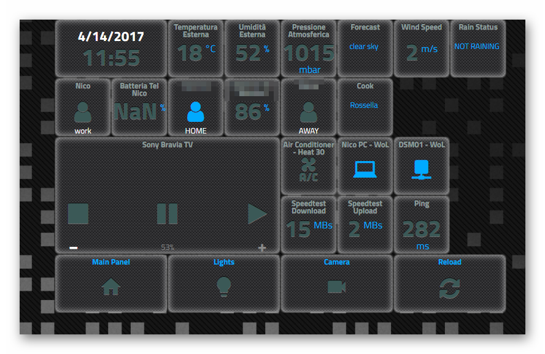
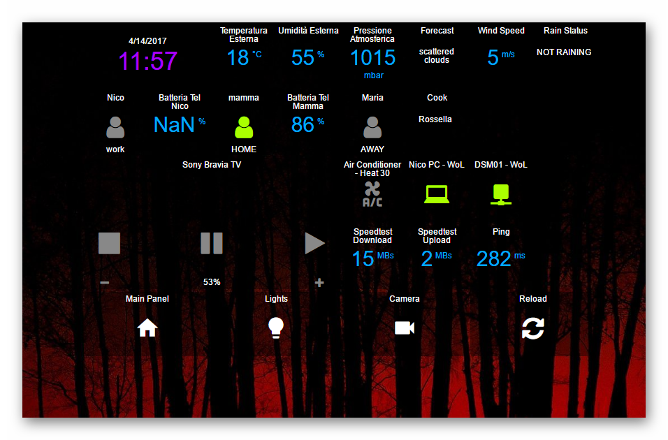

# Appdaemon Template Example By Ciquattro

Appldaemon assistant Configuration

This is my Appdaemon Configuration created with a Docker Installation on a Synology DSM 713+ with an expanded 4GB ram.

- Custom_css Nico
. 

- Custom_css Nicoblack
. 
